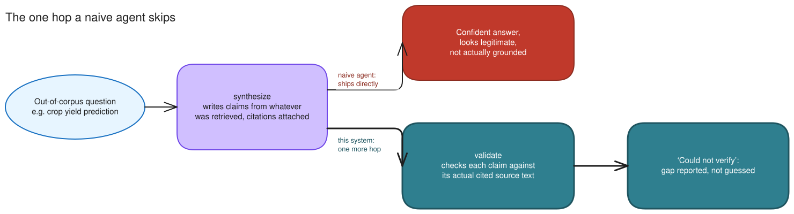
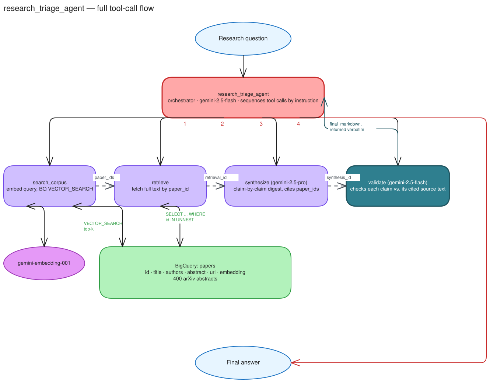
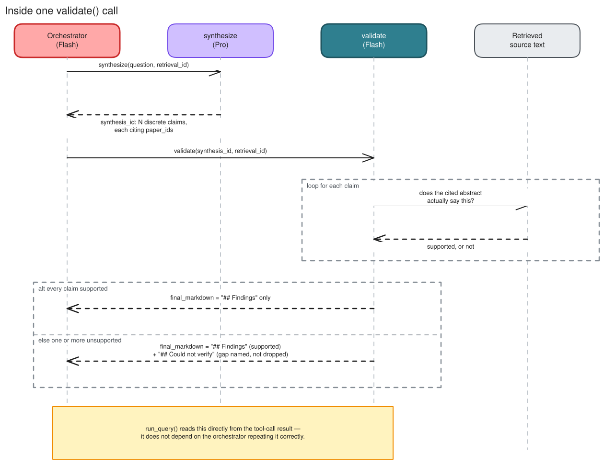

# Research Triage Agent

> A governed agentic RAG reference implementation on Google Cloud, with a reproducible citation-grounding eval.

This is a reference implementation, not a research tool and not a product.
It demonstrates agentic retrieval with an explicit, visible grounding
guardrail, on a small, real corpus, with a reproducible eval of that
guardrail (see [Eval results](#eval-results)). See [Status](#status) for
exactly what is and isn't built.

## Contents

- [What this is not](#what-this-is-not)
- [Topic choice](#topic-choice)
- [Architecture](#architecture)
- [Status](#status)
- [Eval results](#eval-results)
- [Quickstart](#quickstart)
- [Web deployment (Cloud Run)](#web-deployment-cloud-run)
- [Model tier comparison](#model-tier-comparison)
- [Demo script (~3 minutes)](#demo-script-3-minutes)
- [Cost per query](#cost-per-query)
- [Production hardening](#production-hardening)
- [Known limitations](#known-limitations)
- [Repo hygiene](#repo-hygiene)
- [arXiv API usage and terms](#arxiv-api-usage-and-terms)

## What this is not

This is not a literature-review tool, and it is not trying to compete with
the tools that already do that well: **GPT Researcher** (~28k stars, cited
reports from web and local sources), **Stanford STORM** (multi-perspective
retrieval into long-form synthesis), **OpenDraft** (19-agent pipelines
producing 20k-word drafts verified against CrossRef/OpenAlex/arXiv), or
commercial products like **Consensus** (200M papers, per-claim source
links) and **Keenious** (Gemini over OpenAlex). "AI reads papers and writes
a cited summary" is a solved, crowded lane, and none of the above are ADK
implementations, none package a university-IT deployment posture
(per-project cost attribution, audit logging, a data perimeter, an eval
gate in CI), and none ship a portable, reproducible grounding eval you can
point at your own corpus. Those three gaps, an ADK-native implementation,
institutional deployment posture, and a reproducible eval, sit on top of a
standard agentic-RAG pattern here rather than replacing one.

It is also explicitly not the same thing as ADK's own `llm_auditor` sample.
`llm_auditor` uses critic/reviser sub-agents to critique and improve a
response's quality in general terms. This project's `validate` step checks
each individual claim against the specific retrieved source text it cites
and **reports** unsupported claims rather than silently revising them. That's
verification with provenance, not critique.

## Topic choice

The corpus is centered on **the effect of prompt engineering patterns on
LLM-generated code quality**, the author's own dissertation research area
(arXiv `cs.SE`, `cs.CL`, `cs.AI`). arXiv has strong native coverage here, and
personal domain expertise means the person running the demo can judge, in
real time, whether the agent's digest and its guardrail catch are correct, a
more credible test than a topic the presenter would have to take on faith.

## Architecture

`synthesize` writes claims with citations attached regardless of whether
the retrieved papers actually address the question. Citations alone don't
mean grounded. The one thing this system adds on top of that, that a naive
agent doesn't have, is a hop that checks before anything ships:



*(Editable source: [`docs/architecture/guardrail-hop.excalidraw`](docs/architecture/guardrail-hop.excalidraw), open at [excalidraw.com](https://excalidraw.com).)*

Same `synthesize` output, same citations attached either way. The only
difference is whether something reads them before a user does. That single
added hop is the whole pitch. Here's where it sits in the full system:



*(Editable source: [`docs/architecture/system-architecture.excalidraw`](docs/architecture/system-architecture.excalidraw), open at [excalidraw.com](https://excalidraw.com).)*

Tool call order is enforced by instruction (the pattern ADK's own samples
use), not by a hardcoded pipeline. The orchestrator is genuinely deciding
to call each tool, which is what makes this agentic rather than a fixed
script wearing an agent costume. Handles pass between tools
(`paper_ids` → `retrieval_id` → `synthesis_id`, dotted arrows above)
instead of full document text, so the orchestrator never has to retype
large payloads between calls. It only ever sees small ids.

What is *not* left to the orchestrator's discretion is the guardrail's
visibility: `validate` assembles the final answer text itself (supported
findings, then an explicit "Could not verify" section). The orchestrator
is instructed to return that output verbatim, but instruction alone
turned out not to be enough, in testing it was observed silently dropping
the "## Findings" section while keeping "## Could not verify", with no
error. `run_query` (`agent/agent.py`) does not trust the orchestrator's
own text at all: it reads `validate`'s tool-call result directly and only
falls back to the orchestrator's text if `validate` never ran.
Correctness-critical formatting is deterministic code, read by code, not
by convention; only the sequencing decision is agentic. This is what
actually happens inside that one `validate` call:



*(Editable source: [`docs/architecture/validate-sequence.excalidraw`](docs/architecture/validate-sequence.excalidraw), open at [excalidraw.com](https://excalidraw.com).)*

A few design notes:

- **Tiered models.** `search_corpus`'s embedding call and `validate`'s
  per-claim check are cheap, high-volume, low-creativity tasks, so they run
  on Flash. `synthesize`'s writing task is not, so it runs on Pro. The
  orchestrator itself only sequences tool calls, so it runs on Flash too.
  Paying Pro rates for every step is how proof-of-concept economics stop
  working at production volume.
- **No vector index.** BigQuery only populates a `CREATE VECTOR INDEX` once
  the indexed table exceeds ~10 MB; this corpus (a few hundred rows of
  3072-dim float embeddings) sits at or under that line, so `VECTOR_SEARCH`
  correctly falls back to brute force. The index DDL is in
  [`setup/bigquery_schema.sql`](setup/bigquery_schema.sql), commented out,
  for when the corpus grows past that threshold.
- **Naming.** Vertex AI was rebranded to the **Gemini Enterprise Agent
  Platform** at Cloud Next '26 (Vertex AI stopped appearing in the Cloud
  Console on 2026-05-21). The underlying API (`aiplatform.googleapis.com`)
  and most SDK surfaces are unchanged; this README uses "Vertex" and "Gemini
  Enterprise Agent Platform" interchangeably to match current docs.

## Status

| | |
|---|---|
| Tier 1 (interview demo) | Built. See Quickstart below. |
| Tier 1.5 (eval harness) | Built. Real results below; see [`eval/README.md`](eval/README.md) for the metric definitions and how to run it against your own corpus. No CI gate, running it is a manual step before merging a prompt change. |
| Tier 2 (Cloud Run deploy, model comparison) | Built. See [Web deployment](#web-deployment-cloud-run) and [Model tier comparison](#model-tier-comparison). |

## Eval results

25 golden questions (10 answerable, 8 partial, 7 deliberately unanswerable),
graded by an independent judge against `validate()`'s own verdicts. See
[`eval/README.md`](eval/README.md) for what each metric means and how to
run this against your own corpus; full per-claim detail in
[`eval/results/latest.json`](eval/results/latest.json).

Models: orchestrator/validation `gemini-2.5-flash`, synthesis `gemini-2.5-pro`, judge `gemini-2.5-pro`. Run date: 2026-08-13.

| Metric | Value |
|---|---|
| Unsupported-claim rate | 0.9% |
| Citation accuracy | 99.1% |
| False-refusal rate | 0.0% |
| Answerability-category match | 23/25 (92%) |

Both answerability misses were `answerable` questions where the specific
right paper didn't make the top-5 `search_corpus` results, crowded out by
several papers on an adjacent topic (e.g. asking about the effect on
cyclomatic complexity specifically returned five papers about prompting and
code security, none about complexity). `synthesize` correctly produced no
claims rather than stretching an adjacent paper into an answer. That's a
retrieval-recall gap, not a fabrication or over-caution problem, but it's
real: a larger or more diverse corpus, or a higher `top_k`, would likely
close it. All 7 unanswerable questions correctly produced zero fabricated
claims.

This eval also caught a real bug during development, not just the numbers
above: an earlier version of `synthesize` would write true-but-irrelevant
claims when the retrieved papers didn't address the actual question, rather
than recognizing the mismatch, since a claim being individually
well-grounded said nothing about whether it answered what was asked.
Fixed by instructing `synthesize` to produce zero claims when retrieval
doesn't substantively address the question. The numbers above are
post-fix.

## Quickstart

Requires: a GCP project with billing enabled, the `gcloud` CLI, and Python
3.10+.

```bash
git clone https://github.com/curtisdarst/research-triage-agent.git
cd research-triage-agent
python -m venv .venv && source .venv/Scripts/activate  # Windows: .venv\Scripts\activate
pip install -r requirements.txt
cp .env.example .env   # fill in GCP_PROJECT_ID
```

Auth is Application Default Credentials. No service account key is ever
created or stored in this repo:

```bash
gcloud auth login
gcloud auth application-default login
```

Provision BigQuery (idempotent, safe to re-run):

```bash
source .env && bash setup/provision_gcp.sh
```

Ingest the corpus (idempotent: re-running updates rather than duplicates):

```bash
python ingest/ingest_arxiv.py --max-results 400
```

To point ingest at a different topic entirely, override the query
(arXiv's own syntax: `cat:` for category, `abs:"phrase"` for an exact
abstract-text match, `AND`/`OR`/parentheses to combine them; see
[`ingest/arxiv_client.py`](ingest/arxiv_client.py) for the built-in
default):

```bash
python ingest/ingest_arxiv.py --search-query 'cat:cs.CL AND abs:"retrieval augmented generation"'
```

To wipe the corpus before switching topics (no undo except re-ingesting;
asks for a typed `clear` confirmation before deleting anything):

```bash
python ingest/ingest_arxiv.py --clear
```

Run the demo:

```bash
python run_demo.py --demo happy   # answerable from the corpus
python run_demo.py --demo gap     # deliberately out of corpus scope, triggers the guardrail
python run_demo.py --query "your own research question"
```

Each run prints the full tool-call trace (model used, tokens, latency, cost
per step) before the final answer.

## Web deployment (Cloud Run)

Same agent, over HTTP instead of a CLI (`web/main.py`, one FastAPI app, one
static HTML page, no build step). Deploy from source, no Artifact
Registry push needed:

```bash
gcloud run deploy research-triage-agent \
  --region=us-central1 \
  --source=. \
  --service-account=research-triage-web@YOUR_PROJECT_ID.iam.gserviceaccount.com \
  --set-env-vars="GCP_PROJECT_ID=YOUR_PROJECT_ID,GCP_REGION=us-central1,BQ_DATASET=research_triage,BQ_TABLE=papers" \
  --no-allow-unauthenticated \
  --concurrency=1 \
  --min-instances=0 \
  --max-instances=3 \
  --memory=512Mi \
  --timeout=900
```

The runtime service account (`research-triage-web`) has
`bigquery.dataViewer`, `bigquery.dataEditor`, `bigquery.jobUser`, and
`aiplatform.user` (the `dataEditor` role is for the ingest endpoint below,
which writes to BigQuery; query-only access wouldn't cover it), created
the same way as the eval harness's CI service account (see
[`eval/README.md`](eval/README.md)): no downloaded key, Cloud Run attaches
the identity directly. `--timeout=900` (Cloud Run's default is 300s) gives
a large ingest run room to finish; see below.

### How this is secured

Two separate mechanisms, worth naming separately since they're easy to
conflate:

**Who can reach it at all: Cloud Run IAM (`--no-allow-unauthenticated`).**
Every request, including just loading the page, needs a Google-signed
identity token, checked by Cloud Run's own infrastructure *before* the
request reaches the container. This is a platform-level gate, not
application code, there is no auth middleware in `web/main.py` to get
wrong. Only principals holding `roles/run.invoker` on this specific
service can obtain a token that works; by default that's nobody but the
project owner. This matters here specifically because the endpoint calls
Gemini and BigQuery on this project's billing account per request with no
rate limiting built in, so a public URL would be a real cost-abuse
surface, not just a confidentiality one.

**What it can do once it's in: the runtime service identity.** The
container runs as `research-triage-web@...`, scoped to exactly four
roles (`bigquery.dataViewer`, `bigquery.dataEditor`, `bigquery.jobUser`,
`aiplatform.user`), no downloaded key, Cloud Run attaches the identity
directly. No `owner`, no `editor`, no IAM access, no reach into any other
GCP resource. If the container were ever compromised, the blast radius is
bounded to this one BigQuery dataset and Vertex AI quota, not the project.

One honest gap: ingest and admin actions didn't get their own authorization
tier. `roles/run.invoker` is all-or-nothing at the service level, anyone
who can query can also trigger ingest or wipe the corpus. A real
production version would separate read, write, and destructive access at
the app layer instead of treating "in" and "out" as the only two states. The clear-corpus endpoint in particular has no server-side
confirmation step at all, it trusts the caller entirely; the web UI's
`confirm()` dialog (naming the live row count) and the CLI's typed-`clear`
prompt are both client-side conveniences, not a security boundary. There's
also no per-caller rate limiting beyond the `MAX_INGEST_RESULTS` cap and
the ingest lock; auth stops strangers, not an authorized caller
accidentally running something five times in a row.

Access it via an authenticated tunnel rather than a plain link:

```bash
gcloud components install cloud-run-proxy   # one-time, if not already installed
gcloud run services proxy research-triage-agent --region=us-central1
```

This is a foreground process, authenticated as whoever ran it. Leave the
terminal open; it forwards `http://127.0.0.1:8080` to the live service for
as long as it's running, and the page stops working the moment you close
it or Ctrl-C it (you'll see `Failed to fetch` in the browser console if
that happens mid-session, that's this tunnel having dropped, not the
Cloud Run service itself). Anyone else who needs access without running
their own proxy needs `roles/run.invoker`:

```bash
gcloud run services add-iam-policy-binding research-triage-agent \
  --region=us-central1 \
  --member="user:their-email@example.com" \
  --role="roles/run.invoker"
```

This is deployed with `--concurrency=1`. `agent/tools.py` and
`agent/trace.py` hold per-query state (the retrieval/synthesis handle
store, the trace recorder) in module-level singletons, reset at the start
of each request. That's correct for a single-request CLI process, but two
concurrent requests in the same process would corrupt each other's state.
`--concurrency=1` means Cloud Run routes one request at a time per
container instance and spins up separate instances (separate processes)
under concurrent load, which sidesteps the problem without touching the
agent code. It is a real constraint, not a free scaling story: request
volume beyond a few concurrent users would need request-scoped state
instead of module globals. Out of scope for this demo; see [Production
hardening](#production-hardening).

Scales to zero when idle, so there's no cost while nobody's using it.

Ingest and corpus management are also exposed in the web UI, behind a
collapsed "Admin" section on the same page, not a separate route. It calls
the same `run_ingest()` used by the CLI (`ingest/ingest_arxiv.py`), so
it's the identical idempotent fetch-embed-upsert pipeline, just triggered
by a button instead of a terminal command. Progress streams to the page
live (Server-Sent Events over the same POST connection, not polling: a
single request stays open for the run's duration and the fetch/embed/
upsert lines `run_ingest`'s `on_progress` already produced for the CLI
now render as they happen instead of the page going quiet for however
many minutes a large run takes). The search query field is
prepopulated from `GET /api/ingest/default-query` (the same
`SEARCH_QUERY` the CLI defaults to) but editable, so retargeting the
corpus at a different topic doesn't require touching source code, just
arXiv's own query syntax (`cat:`, `abs:"phrase"`, `AND`/`OR`). A separate
"Clear the corpus" control calls `POST /api/admin/clear-corpus`, which
deletes every row via the same `clear_corpus()` the CLI's `--clear` flag
uses; the web UI's own confirmation is a `confirm()` dialog naming the
live row count fetched from `GET /api/admin/corpus-count` immediately
before asking, not a server-side check (see the honest gap note above).
Everything in this section is protected by the exact same Cloud Run
authentication as the query endpoint, nothing new is exposed by adding
it, but ingest has its own lock (`_INGEST_LOCK`, separate from
`_QUERY_LOCK`, also held during clear-corpus) since it doesn't touch
`agent/tools.py`'s state at all, and a server-side cap
(`MAX_INGEST_RESULTS = 2000`) so a typo in the number field can't trigger
an hours-long run.

## Model tier comparison

The same retrieval, synthesized once by Flash and once by Pro, so the only
variable is the synthesis model. Both outputs then go through the same
Flash `validate()` guardrail, so "quality" is a measured claim count, not
a subjective read:

```bash
python scripts/compare_models.py
```

Real run, 2026-08-14, happy-path question (cost figures corrected for
thinking tokens, see [Cost per query](#cost-per-query); this script calls
`synthesize`/`validate` directly rather than through the orchestrator, so
the orchestrator-tracing fix doesn't apply here, there's no orchestrator
in this path to begin with):

| Model | Claims | Supported | Cost | Latency |
|---|---|---|---|---|
| gemini-2.5-flash | 7 | 7 | $0.01143 | 23.1s |
| gemini-2.5-pro | 6 | 6 | $0.02583 | 28.2s |

Pro cost 2.3x more and took 1.2x longer. Both digests were fully grounded
this run (0 unsupported on either side), so this particular comparison
doesn't show a correctness gap, it shows a completeness/style one: Flash
wrote seven more granular, narrowly-scoped claims where Pro covered
similar ground in six fuller sentences. Flash is the right choice for
`validate()`, where the task is a bounded yes/no check per claim. For
`synthesize()`, where the task is judging which of several retrieved
papers is worth including and writing a coherent digest from them, this
run is a real, measured example of why the README's "why tiered models"
reasoning holds: paying Pro rates for that judgment call buys a
different, arguably more coherent answer, not just a slower one. Claim
counts and specific findings vary run to run (this is a live model, not a
fixture), so treat the exact numbers as one measured sample, not a fixed
guarantee, and re-run it yourself if you want a fresher one.

## Demo script (~3 minutes)

1. **Frame it in ten seconds.** "Research offices want literature triage
   and will not deploy it, because the failure mode is confident fabricated
   citations. This is that workflow with the failure mode handled."
2. **Run the happy path** (`--demo happy`). Show the digest. Point at the
   inline citations. Point at the trace showing four discrete tool calls,
   not one prompt.
3. **Run the out-of-corpus query** (`--demo gap`). Let it flag. Say: "That
   is the whole demo. The interesting behavior is the refusal, not the
   answer."
4. **Name the cost.** "About a penny per query: a bit more when it finds a
   real answer to synthesize and validate, less than that when it correctly
   refuses. Uses Flash for retrieval and validation, Pro only for
   synthesis." (see [Cost per query](#cost-per-query) below for exact
   measured numbers)
5. **Point at production.** "In a real deployment this sits behind VPC
   Service Controls, the agent has its own identity in the registry, and
   the eval suite runs in CI so a prompt change can't silently regress
   citation accuracy."

Then stop talking. Do not narrate the code.

## Cost per query

Measured, not estimated. See the trace output of an actual run for exact
figures. As of 2026-08-13 pricing (`agent/config.py`, `ai.google.dev/gemini-api/docs/pricing`):

| Step | Model | Rate |
|---|---|---|
| `search_corpus` (embed) | gemini-embedding-001 | $0.15 / 1M input tokens |
| `synthesize` | gemini-2.5-pro | $1.25 / 1M in, $10.00 / 1M out |
| `validate` | gemini-2.5-flash | $0.30 / 1M in, $2.50 / 1M out |
| orchestrator (tool-call sequencing) | gemini-2.5-flash | $0.30 / 1M in, $2.50 / 1M out |

Every cost figure this project reported before 2026-08-14 was an
undercount, caught against an actual GCP billing export rather than in a
code review, for two independent reasons, both now fixed:

1. 2.5-series models emit internal "thinking" tokens by default
   (`usage_metadata.thoughts_token_count`), invisible in the response
   text but billed at the same per-token rate as visible output. Every
   `out_tok` figure here previously read only `candidates_token_count`.
   For a one-word test answer, thinking tokens outnumbered visible output
   135:1. `agent/config.py`'s `billed_output_tokens()` now adds both.
2. The orchestrator's own tool-sequencing decisions (five Gemini calls
   per query: one per tool plus a final turn) were never traced at all,
   only the four named tools' *internal* calls were. `run_query()` now
   sums `usage_metadata` off every ADK event and records it as its own
   trace row.

Both were found while investigating why a billing report didn't match
this README's own numbers, prompted by a direct question about whether
the charges "added up." They didn't. The fix is in `agent/tools.py`,
`agent/agent.py`, and `eval/judge.py`; every number below is post-fix.

Actual measured runs against the 400-paper corpus, 2026-08-14:

| Query | Claims | Tokens (in/out) | Cost | Wall clock |
|---|---|---|---|---|
| `--demo happy` (answerable) | 6 synthesized, 6 supported | 12,864 / 5,010 | **$0.0327** | 66.6s |
| `--demo gap` (out of corpus) | 0 synthesized, refused rather than guessed | 9,641 / 1,248 | **$0.0136** | 27.2s |

The refusal path is still both faster and cheaper than a real answer,
that finding held up: `synthesize` declines to invent claims once it has
nothing to ground them in, so `validate` has nothing to check and the
whole run short-circuits. Cheap honesty, not just correct honesty. What
changed is the absolute numbers, both cost roughly 3-5x more than
previously reported once thinking tokens and orchestrator overhead are
counted.

Corpus ingest (400 abstracts, one-time, re-run only when refreshing the
corpus): **$0.017** in embedding calls. Unaffected by either bug,
`gemini-embedding-001` doesn't do extended thinking and ingest doesn't
go through the orchestrator at all.

## Production hardening

This demo intentionally does not include:

- **VPC Service Controls** around the BigQuery corpus and the Vertex/Gemini
  Enterprise Agent Platform endpoints, to enforce a data perimeter.
- **CMEK** (customer-managed encryption keys) on the BigQuery dataset.
- **Agent Registry**: the Cloud Run deployment has its own scoped service
  identity (`research-triage-web`, BigQuery + Vertex AI roles only, no
  downloaded key), but it isn't registered anywhere. Local CLI use still
  runs as whoever's ADC is active, which is fine for a demo but not for a
  fleet of agents someone else needs to inventory and audit.
- **Per-project cost attribution** for grant accounting: nothing here tags
  spend by requesting project or grant. A real deployment would need that
  before "who's paying for this query" is answerable.
- **Audit logging** of every query and every guardrail trigger, for
  research-integrity review.
- **Human review** gating any output that goes into an actual digest sent
  to a PI or research office, not just this CLI's console.
- **Eval in CI**: the eval harness exists (see [Eval results](#eval-results))
  but isn't wired into a merge gate. A prompt change to `synthesize` or
  `validate` can currently regress citation accuracy or spike the
  false-refusal rate without anything blocking the merge; running
  `eval/run_eval.py` before merging such a change is a manual step.

## Known limitations

- **The validator is itself an LLM**, and therefore has its own error
  rate: both false negatives (missing a real fabrication) and false
  positives (flagging a claim that was actually supported, i.e.
  false-refusal). The eval harness's false-refusal-rate metric exists
  specifically to measure this, because it's the failure mode people
  forget to check for when they build a guardrail.
- **Corpus freshness**: the demo corpus is a one-time arXiv pull, not a
  live feed.
- **Fresh-project Vertex quota is low by default.** A newly created GCP
  project's default per-minute Gemini/Vertex quota is easy to hit if you
  run several queries back to back (you'll see `429 RESOURCE_EXHAUSTED`).
  Space queries out, or request a quota increase, if you're demoing
  multiple runs in quick succession.
- **The orchestrator's final text turn is not trustworthy on its own.**
  It's instructed to echo `validate()`'s `final_markdown` verbatim, but
  has been observed doing the opposite: silently dropping the entire "##
  Findings" section while keeping "## Could not verify", with no error and
  a non-empty response. `run_query` in `agent/agent.py` does not treat the
  orchestrator's text as authoritative at all; it reads `validate()`'s
  tool-call result directly and only falls back to the orchestrator's own
  text if `validate()` never ran. That is what actually makes "the
  orchestrator cannot paraphrase the gap away" true, not the instruction
  by itself, an instruction alone was demonstrably not enough.
- **arXiv abstract search is loose.** An early version of the ingest query
  used bare terms like `"chain-of-thought"` without requiring co-occurrence
  with a code-related term, which pulled in unrelated domains (e.g.
  clinical/medical LLM-prompting papers) on phrase overlap alone. The
  query in `ingest/arxiv_client.py` now anchors every prompting-related
  term to a code term explicitly. Worth knowing if you retarget this at a
  different topic.
- **Embedding drift**: if `gemini-embedding-001` is ever updated, existing
  stored embeddings and new query embeddings could drift out of the same
  space; re-ingesting is the correct fix, not a partial re-embed.
- **No authentication or multi-user support**: out of scope by design, a
  future tier of work, not an oversight.
- **Corpus size is small by design** (400 abstracts on one narrow topic),
  which is also why no vector index is created. See Architecture.

## Repo hygiene

- Apache 2.0 licensed.
- No credentials, API keys, or `.env` committed. `.gitignore` blocks all
  of these; see `.env.example` for the variables you need.
- `google-adk` is pinned exactly (`requirements.txt`) because ADK 2.0
  shipped breaking changes to the agent API, event model, and session
  schema. An unpinned dependency here rots fast.
- Personal Google Cloud account, personal time, public arXiv data only. No
  employer affiliation anywhere in this repo.

## arXiv API usage and terms

`ingest/arxiv_client.py` calls arXiv's public API (`export.arxiv.org/api/query`)
as a personal, non-commercial, open-source project, under [arXiv's API access
policy](https://info.arxiv.org/help/api/index.html) and [Terms of
Use](https://info.arxiv.org/help/api/tou.html). How this project fits inside
them, plainly:

- **Independent, not affiliated.** arXiv's access policy places
  noncommercial, open-source projects that use the public API without
  requiring staff assistance, and without arXiv branding, in a category it
  describes as "entirely independent from arXiv." This repo does exactly
  that: no arXiv name or logo anywhere, no claim of endorsement, sponsorship,
  or partnership.
- **Metadata only, nothing rehosted.** `fetch_papers()` retrieves descriptive
  metadata (title, authors, abstract, published date, arXiv id), never a PDF
  or source file. The stored `url` field points back to the paper's official
  `arxiv.org/abs/...` page rather than serving the paper from this project's
  own infrastructure, in line with the Terms of Use's restriction on
  redistributing e-print content from your own servers.
- **Rate limiting enforced in code, not just promised in prose.** The Terms
  require no more than one request every three seconds, on a single
  connection, with no workaround via parallel requests. `REQUEST_DELAY_SECONDS
  = 3.0` in `ingest/arxiv_client.py` is that limit, enforced by a `time.sleep`
  between sequential `requests.get()` calls; there is no concurrency anywhere
  in the fetch path that could violate it.
- **Attribution.** Per arXiv's request: "Thank you to arXiv for use of its
  open access interoperability."

If this project's ingest ever moved from a manual, one-off corpus refresh to
a scheduled job pulling continuously, both documents would be worth
re-reading, the access category this project currently sits in assumes
occasional, human-triggered use, not a standing service. Re-reading a terms
page is cheap; getting rate-limited by shared research infrastructure other
people depend on is not.
