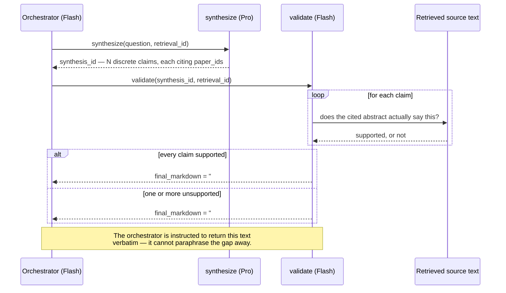

# Research Triage Agent

> A governed agentic RAG reference implementation on Google Cloud, with a reproducible citation-grounding eval.

This is a reference implementation, not a research tool and not a product. It
demonstrates a pattern — agentic retrieval with an explicit, visible
grounding guardrail — on a small, real corpus, and it will ship a
reproducible eval of that guardrail before it is presented as anything more
than a demo. See [Status](#status) for exactly what is and isn't built yet.

## What this is not

This is not a literature-review tool, and it is not trying to compete with
the tools that already do that well: **GPT Researcher** (~28k stars, cited
reports from web and local sources), **Stanford STORM** (multi-perspective
retrieval into long-form synthesis), **OpenDraft** (19-agent pipelines
producing 20k-word drafts verified against CrossRef/OpenAlex/arXiv), or
commercial products like **Consensus** (200M papers, per-claim source
links) and **Keenious** (Gemini over OpenAlex). "AI reads papers and writes
a cited summary" is a solved, crowded lane, and none of the above are ADK
implementations, none package a university-IT deployment posture
(per-project cost attribution, audit logging, a data perimeter, an eval
gate in CI), and none ship a portable, reproducible grounding eval you can
point at your own corpus. Those three gaps — an ADK-native implementation,
institutional deployment posture, and a reproducible eval — are what this
project occupies, on top of a standard agentic-RAG pattern, not instead of
one.

It is also explicitly not the same thing as ADK's own `llm_auditor` sample.
`llm_auditor` uses critic/reviser sub-agents to critique and improve a
response's quality in general terms. This project's `validate` step checks
each individual claim against the specific retrieved source text it cites
and **reports** unsupported claims rather than silently revising them —
verification with provenance, not critique.

## Topic choice

The brief this was built from suggested a hard-science, institution-adjacent
topic (materials science, agricultural genomics, medical imaging). This
build instead uses a corpus centered on **the effect of prompt engineering
patterns on LLM-generated code quality** — the author's own dissertation
research area (arXiv `cs.SE`, `cs.CL`, `cs.AI`). That's a deliberate
substitution, not a shortcut: arXiv has strong native coverage of the
topic, and personal domain expertise means the person running the demo can
actually judge, in real time, whether the agent's digest and its guardrail
catch are correct — which is a more credible test of the pattern than a
topic the presenter would have to take on faith.

## Architecture

The orchestrator is a single ADK agent that decides, turn by turn, which of
the four tools to call next — it is not a hardcoded pipeline. What *is*
hardcoded is what happens inside `validate`: it checks each claim against
its cited source text and assembles the final answer itself, so the
guardrail's visibility doesn't depend on the orchestrator faithfully
repeating it.

```mermaid
flowchart TB
    U(["Research question"]) --> O

    subgraph Orchestrator["ADK orchestrator — gemini-2.5-flash · sequences tool calls by instruction"]
        O["research_triage_agent"]
    end

    O -->|"1"| T1["search_corpus<br/><i>embed query, BQ VECTOR_SEARCH</i>"]
    O -->|"2"| T2["retrieve<br/><i>fetch full text by paper_id</i>"]
    O -->|"3"| T3["synthesize<br/><i>gemini-2.5-pro</i><br/>claim-by-claim digest, cites paper_ids"]
    O -->|"4"| T4["validate<br/><i>gemini-2.5-flash</i><br/>checks each claim vs. its cited source text"]

    EMB[["gemini-embedding-001"]]
    T1 <--> EMB
    T1 <-->|"VECTOR_SEARCH top-k"| BQ[("BigQuery: papers<br/>id · title · authors · abstract · url · embedding<br/>~400 arXiv abstracts")]
    T2 <-->|"SELECT ... WHERE id IN UNNEST"| BQ

    T1 -.->|"paper_ids"| T2
    T2 -.->|"retrieval_id"| T3
    T3 -.->|"synthesis_id"| T4

    T4 -->|"final_markdown, returned verbatim"| O
    O --> A(["Final answer"])

    style T4 fill:#4a2020,stroke:#c0392b,stroke-width:2px
```



The guardrail is the reason this is worth looking at, so it's worth
diagramming on its own — this is what actually happens inside a single
`validate` call:



Tool call order is enforced by instruction (the pattern ADK's own samples
use), not by a hardcoded pipeline — the orchestrator is genuinely deciding
to call each tool, which is what makes this agentic rather than a fixed
script wearing an agent costume. What is *not* left to the orchestrator's
discretion is the guardrail's visibility: `validate` assembles the final
answer text itself (supported findings, then an explicit "Could not
verify" section), and the orchestrator is instructed to return that output
verbatim. Correctness-critical formatting is deterministic code; only the
sequencing decision is agentic.

**Why tiered models**: `search_corpus`'s embedding call and `validate`'s
per-claim check are cheap, high-volume, low-creativity tasks — Flash.
`synthesize`'s writing task is not — Pro. The orchestrator itself only
sequences tool calls, so it runs on Flash too. Paying Pro rates for every
step is how proof-of-concept economics stop working at production volume.

**Why no vector index**: BigQuery only populates a `CREATE VECTOR INDEX`
once the indexed table exceeds ~10 MB; this corpus (a few hundred rows of
3072-dim float embeddings) sits at or under that line, so `VECTOR_SEARCH`
correctly falls back to brute force. The index DDL is in
[`setup/bigquery_schema.sql`](setup/bigquery_schema.sql), commented out,
for when the corpus grows past that threshold.

**Note on naming**: Vertex AI was rebranded to the **Gemini Enterprise
Agent Platform** at Cloud Next '26 (Vertex AI stopped appearing in the
Cloud Console on 2026-05-21). The underlying API (`aiplatform.googleapis.com`)
and most SDK surfaces are unchanged; this README uses "Vertex" and "Gemini
Enterprise Agent Platform" interchangeably to match current docs.

## Status

| | |
|---|---|
| Tier 1 (interview demo) | Built. See Quickstart below. |
| Tier 1.5 (eval harness + CI gate) | **Not built.** Required before this repo is public — see [`eval/README.md`](eval/README.md). |
| Tier 2 (Cloud Run deploy, model comparison) | Not built. Local CLI only for now. |

## Eval results

Not run yet — the eval harness itself doesn't exist (Tier 1.5, see
[`eval/README.md`](eval/README.md)). This table will be filled in with
unsupported-claim rate, citation accuracy, false-refusal rate, model
version, and run date once it does. No numbers are fabricated here in the
meantime.

## Quickstart

Requires: a GCP project with billing enabled, the `gcloud` CLI, and Python
3.10+.

```bash
git clone https://github.com/curtisdarst/research-triage-agent.git
cd research-triage-agent
python -m venv .venv && source .venv/Scripts/activate  # Windows: .venv\Scripts\activate
pip install -r requirements.txt
cp .env.example .env   # fill in GCP_PROJECT_ID
```

Auth is Application Default Credentials — no service account key is ever
created or stored in this repo:

```bash
gcloud auth login
gcloud auth application-default login
```

Provision BigQuery (idempotent, safe to re-run):

```bash
source .env && bash setup/provision_gcp.sh
```

Ingest the corpus (idempotent — re-running updates rather than duplicates):

```bash
python ingest/ingest_arxiv.py --max-results 400
```

Run the demo:

```bash
python run_demo.py --demo happy   # answerable from the corpus
python run_demo.py --demo gap     # deliberately out of corpus scope — triggers the guardrail
python run_demo.py --query "your own research question"
```

Each run prints the full tool-call trace (model used, tokens, latency, cost
per step) before the final answer.

## Demo script (~3 minutes)

1. **Frame it in ten seconds.** "Research offices want literature triage
   and will not deploy it, because the failure mode is confident fabricated
   citations. This is that workflow with the failure mode handled."
2. **Run the happy path** (`--demo happy`). Show the digest. Point at the
   inline citations. Point at the trace showing four discrete tool calls,
   not one prompt.
3. **Run the out-of-corpus query** (`--demo gap`). Let it flag. Say: "That
   is the whole demo. The interesting behavior is the refusal, not the
   answer."
4. **Name the cost.** "About a penny per query — a bit more when it finds a
   real answer to synthesize and validate, less than that when it correctly
   refuses — using Flash for retrieval and validation and Pro only for
   synthesis." (see [Cost per query](#cost-per-query) below for exact
   measured numbers)
5. **Point at production.** "In a real deployment this sits behind VPC
   Service Controls, the agent has its own identity in the registry, and
   the eval suite runs in CI so a prompt change can't silently regress
   citation accuracy."

Then stop talking. Do not narrate the code.

## Cost per query

Measured, not estimated — see the trace output of an actual run for exact
figures. As of 2026-08-13 pricing (`agent/config.py`, `ai.google.dev/gemini-api/docs/pricing`):

| Step | Model | Rate |
|---|---|---|
| `search_corpus` (embed) | gemini-embedding-001 | $0.15 / 1M input tokens |
| `synthesize` | gemini-2.5-pro | $1.25 / 1M in, $10.00 / 1M out |
| `validate` | gemini-2.5-flash | $0.30 / 1M in, $2.50 / 1M out |

Actual measured runs against the 400-paper corpus, 2026-08-13:

| Query | Claims | Tokens (in/out) | Cost | Wall clock |
|---|---|---|---|---|
| `--demo happy` (answerable) | 8 synthesized, 7 supported, 1 caught by validator | 4,968 / 1,612 | **$0.0123** | 74.0s |
| `--demo gap` (out of corpus) | 0 synthesized — refused rather than guessed | 1,882 / 9 | **$0.0024** | 22.2s |

The refusal path is both faster and cheaper than a real answer — `synthesize`
declines to invent claims once it has nothing to ground them in, so
`validate` has nothing to check and the whole run short-circuits. Cheap
honesty, not just correct honesty.

Corpus ingest (400 abstracts, one-time, re-run only when refreshing the
corpus): **$0.017** in embedding calls.

## Production hardening

This demo intentionally does not include:

- **VPC Service Controls** around the BigQuery corpus and the Vertex/Gemini
  Enterprise Agent Platform endpoints, to enforce a data perimeter.
- **CMEK** (customer-managed encryption keys) on the BigQuery dataset.
- **Agent Identity and Registry** — this agent has no identity of its own;
  it runs as whoever's ADC is active. A real deployment gives it a service
  identity, registers it, and scopes its BigQuery/Vertex IAM roles tightly.
- **Per-project cost attribution** for grant accounting — the Cloud Run
  deployment (Tier 2, not built) would tag spend by requesting
  project/grant.
- **Audit logging** of every query and every guardrail trigger, for
  research-integrity review.
- **Human review** gating any output that goes into an actual digest sent
  to a PI or research office, not just this CLI's console.
- **Eval in CI** (Tier 1.5) — a prompt change to `synthesize` or `validate`
  should not be mergeable if it regresses citation accuracy or spikes the
  false-refusal rate.

## Known limitations

- **The validator is itself an LLM**, and therefore has its own error
  rate — both false negatives (missing a real fabrication) and false
  positives (flagging a claim that was actually supported, i.e.
  false-refusal). The eval harness's false-refusal-rate metric exists
  specifically to measure this, because it's the failure mode people
  forget to check for when they build a guardrail.
- **Corpus freshness**: the demo corpus is a one-time arXiv pull, not a
  live feed.
- **Fresh-project Vertex quota is low by default.** A newly created GCP
  project's default per-minute Gemini/Vertex quota is easy to hit if you
  run several queries back to back (you'll see `429 RESOURCE_EXHAUSTED`).
  Space queries out, or request a quota increase, if you're demoing
  multiple runs in quick succession. Separately: the orchestrator's own
  final "echo the answer" turn occasionally doesn't come through even on a
  successful run (same class of transient issue); `run_query` in
  `agent/agent.py` falls back to reading `validate`'s output directly from
  the tool-call event rather than depending on the orchestrator to repeat
  it, so the answer still surfaces reliably either way.
- **arXiv abstract search is loose.** An early version of the ingest query
  used bare terms like `"chain-of-thought"` without requiring co-occurrence
  with a code-related term, which pulled in unrelated domains (e.g.
  clinical/medical LLM-prompting papers) on phrase overlap alone. The
  query in `ingest/arxiv_client.py` now anchors every prompting-related
  term to a code term explicitly — worth knowing if you retarget this at a
  different topic.
- **Embedding drift**: if `gemini-embedding-001` is ever updated, existing
  stored embeddings and new query embeddings could drift out of the same
  space; re-ingesting is the correct fix, not a partial re-embed.
- **No authentication or multi-user support** — out of scope by design
  (see the original build brief's Tier 3).
- **Corpus size is small by design** (400 abstracts on one narrow topic),
  which is also why no vector index is created — see Architecture.

## Repo hygiene

- Apache 2.0 licensed.
- No credentials, API keys, or `.env` committed — `.gitignore` blocks all
  of these; see `.env.example` for the variables you need.
- `google-adk` is pinned exactly (`requirements.txt`) because ADK 2.0
  shipped breaking changes to the agent API, event model, and session
  schema — an unpinned dependency here rots fast.
- Personal Google Cloud account, personal time, public arXiv data only. No
  employer affiliation anywhere in this repo.
