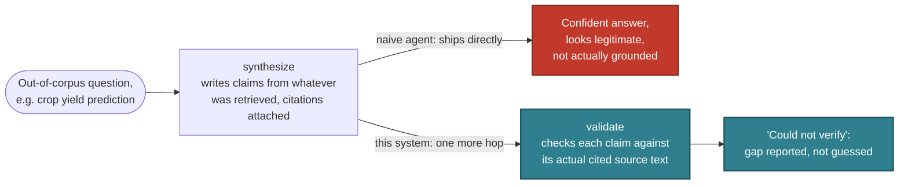
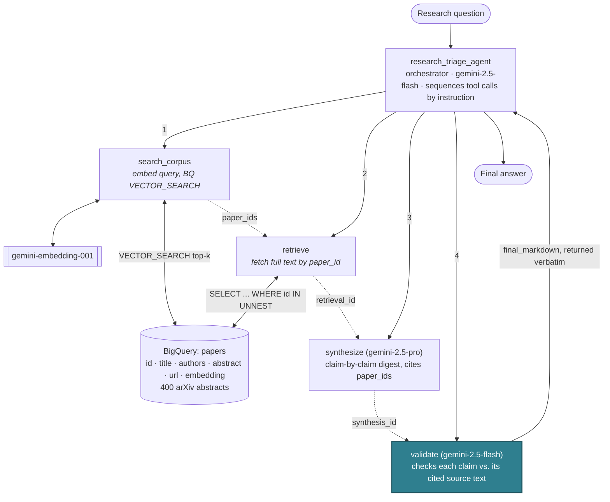
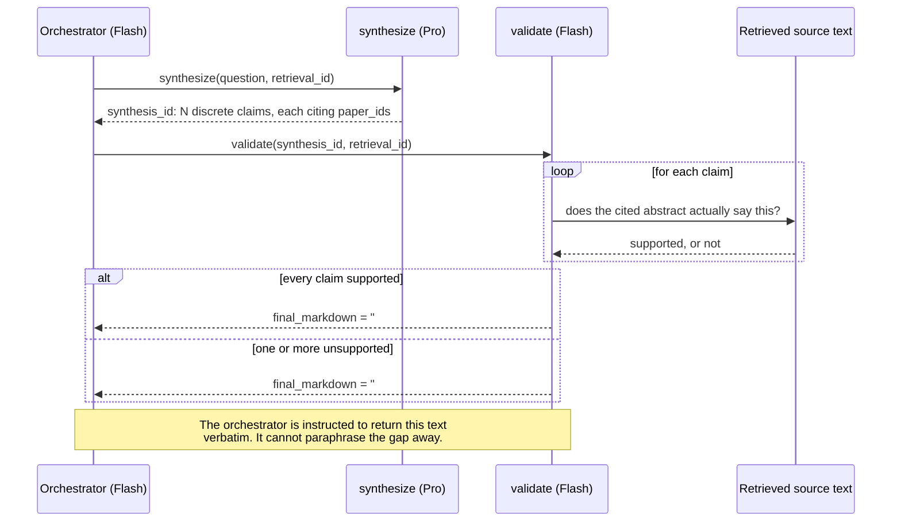

# Research Triage Agent

> A governed agentic RAG reference implementation on Google Cloud, with a reproducible citation-grounding eval.

This is a reference implementation, not a research tool and not a product.
It demonstrates agentic retrieval with an explicit, visible grounding
guardrail, on a small, real corpus, with a reproducible eval of that
guardrail (see [Eval results](#eval-results)). See [Status](#status) for
exactly what is and isn't built.

## What this is not

This is not a literature-review tool, and it is not trying to compete with
the tools that already do that well: **GPT Researcher** (~28k stars, cited
reports from web and local sources), **Stanford STORM** (multi-perspective
retrieval into long-form synthesis), **OpenDraft** (19-agent pipelines
producing 20k-word drafts verified against CrossRef/OpenAlex/arXiv), or
commercial products like **Consensus** (200M papers, per-claim source
links) and **Keenious** (Gemini over OpenAlex). "AI reads papers and writes
a cited summary" is a solved, crowded lane, and none of the above are ADK
implementations, none package a university-IT deployment posture
(per-project cost attribution, audit logging, a data perimeter, an eval
gate in CI), and none ship a portable, reproducible grounding eval you can
point at your own corpus. Those three gaps (an ADK-native implementation,
institutional deployment posture, and a reproducible eval) are what this
project occupies, on top of a standard agentic-RAG pattern, not instead of
one.

It is also explicitly not the same thing as ADK's own `llm_auditor` sample.
`llm_auditor` uses critic/reviser sub-agents to critique and improve a
response's quality in general terms. This project's `validate` step checks
each individual claim against the specific retrieved source text it cites
and **reports** unsupported claims rather than silently revising them. That's
verification with provenance, not critique.

## Topic choice

The brief this was built from suggested a hard-science, institution-adjacent
topic (materials science, agricultural genomics, medical imaging). This
build instead uses a corpus centered on **the effect of prompt engineering
patterns on LLM-generated code quality**, the author's own dissertation
research area (arXiv `cs.SE`, `cs.CL`, `cs.AI`). That's a deliberate
substitution, not a shortcut: arXiv has strong native coverage of the
topic, and personal domain expertise means the person running the demo can
actually judge, in real time, whether the agent's digest and its guardrail
catch are correct. That's a more credible test of the pattern than a topic
the presenter would have to take on faith.

## Architecture

`synthesize` writes claims with citations attached regardless of whether
the retrieved papers actually address the question. Citations alone don't
mean grounded. The one thing this system adds on top of that, that a naive
agent doesn't have, is a hop that checks before anything ships:



Same `synthesize` output, same citations attached either way. The only
difference is whether something reads them before a user does. That single
added hop is the whole pitch. Here's where it sits in the full system:



Tool call order is enforced by instruction (the pattern ADK's own samples
use), not by a hardcoded pipeline. The orchestrator is genuinely deciding
to call each tool, which is what makes this agentic rather than a fixed
script wearing an agent costume. Handles pass between tools
(`paper_ids` → `retrieval_id` → `synthesis_id`, dotted arrows above)
instead of full document text, so the orchestrator never has to retype
large payloads between calls. It only ever sees small ids.

What is *not* left to the orchestrator's discretion is the guardrail's
visibility: `validate` assembles the final answer text itself (supported
findings, then an explicit "Could not verify" section), and the
orchestrator is instructed to return that output verbatim.
Correctness-critical formatting is deterministic code; only the sequencing
decision is agentic. This is what actually happens inside that one
`validate` call:



**Why tiered models**: `search_corpus`'s embedding call and `validate`'s
per-claim check are cheap, high-volume, low-creativity tasks, so they run
on Flash. `synthesize`'s writing task is not, so it runs on Pro. The
orchestrator itself only sequences tool calls, so it runs on Flash too.
Paying Pro rates for every step is how proof-of-concept economics stop
working at production volume.

**Why no vector index**: BigQuery only populates a `CREATE VECTOR INDEX`
once the indexed table exceeds ~10 MB; this corpus (a few hundred rows of
3072-dim float embeddings) sits at or under that line, so `VECTOR_SEARCH`
correctly falls back to brute force. The index DDL is in
[`setup/bigquery_schema.sql`](setup/bigquery_schema.sql), commented out,
for when the corpus grows past that threshold.

**Note on naming**: Vertex AI was rebranded to the **Gemini Enterprise
Agent Platform** at Cloud Next '26 (Vertex AI stopped appearing in the
Cloud Console on 2026-05-21). The underlying API (`aiplatform.googleapis.com`)
and most SDK surfaces are unchanged; this README uses "Vertex" and "Gemini
Enterprise Agent Platform" interchangeably to match current docs.

## Status

| | |
|---|---|
| Tier 1 (interview demo) | Built. See Quickstart below. |
| Tier 1.5 (eval harness + CI gate) | Built. Real results below; see [`eval/README.md`](eval/README.md) for the metric definitions and how to run it against your own corpus. |
| Tier 2 (Cloud Run deploy, model comparison) | Cloud Run deploy built (see [Web deployment](#web-deployment-cloud-run)). Model tier comparison not built. |

## Eval results

25 golden questions (10 answerable, 8 partial, 7 deliberately unanswerable),
graded by an independent judge against `validate()`'s own verdicts. See
[`eval/README.md`](eval/README.md) for what each metric means and how to
run this against your own corpus; full per-claim detail in
[`eval/results/latest.json`](eval/results/latest.json).

Models: orchestrator/validation `gemini-2.5-flash`, synthesis `gemini-2.5-pro`, judge `gemini-2.5-pro`. Run date: 2026-08-13.

| Metric | Value |
|---|---|
| Unsupported-claim rate | 0.9% |
| Citation accuracy | 99.1% |
| False-refusal rate | 0.0% |
| Answerability-category match | 23/25 (92%) |

Both answerability misses were `answerable` questions where the specific
right paper didn't make the top-5 `search_corpus` results, crowded out by
several papers on an adjacent topic (e.g. asking about the effect on
cyclomatic complexity specifically returned five papers about prompting and
code security, none about complexity). `synthesize` correctly produced no
claims rather than stretching an adjacent paper into an answer. That's a
retrieval-recall gap, not a fabrication or over-caution problem, but it's
real: a larger or more diverse corpus, or a higher `top_k`, would likely
close it. All 7 unanswerable questions correctly produced zero fabricated
claims.

This eval also caught a real bug during development, not just the numbers
above: an earlier version of `synthesize` would write true-but-irrelevant
claims when the retrieved papers didn't address the actual question, rather
than recognizing the mismatch, since a claim being individually
well-grounded said nothing about whether it answered what was asked.
Fixed by instructing `synthesize` to produce zero claims when retrieval
doesn't substantively address the question. The numbers above are
post-fix.

## Quickstart

Requires: a GCP project with billing enabled, the `gcloud` CLI, and Python
3.10+.

```bash
git clone https://github.com/curtisdarst/research-triage-agent.git
cd research-triage-agent
python -m venv .venv && source .venv/Scripts/activate  # Windows: .venv\Scripts\activate
pip install -r requirements.txt
cp .env.example .env   # fill in GCP_PROJECT_ID
```

Auth is Application Default Credentials. No service account key is ever
created or stored in this repo:

```bash
gcloud auth login
gcloud auth application-default login
```

Provision BigQuery (idempotent, safe to re-run):

```bash
source .env && bash setup/provision_gcp.sh
```

Ingest the corpus (idempotent: re-running updates rather than duplicates):

```bash
python ingest/ingest_arxiv.py --max-results 400
```

Run the demo:

```bash
python run_demo.py --demo happy   # answerable from the corpus
python run_demo.py --demo gap     # deliberately out of corpus scope, triggers the guardrail
python run_demo.py --query "your own research question"
```

Each run prints the full tool-call trace (model used, tokens, latency, cost
per step) before the final answer.

## Web deployment (Cloud Run)

Same agent, over HTTP instead of a CLI (`web/main.py`, one FastAPI app, one
static HTML page, no build step). Live at
`research-triage-agent-410914749671.us-central1.run.app` (auth required,
see below). Deploy from source, no Artifact Registry push needed:

```bash
gcloud run deploy research-triage-agent \
  --region=us-central1 \
  --source=. \
  --service-account=research-triage-web@YOUR_PROJECT_ID.iam.gserviceaccount.com \
  --set-env-vars="GCP_PROJECT_ID=YOUR_PROJECT_ID,GCP_REGION=us-central1,BQ_DATASET=research_triage,BQ_TABLE=papers" \
  --no-allow-unauthenticated \
  --concurrency=1 \
  --min-instances=0 \
  --max-instances=3 \
  --memory=512Mi
```

The runtime service account (`research-triage-web`) has only
`bigquery.dataViewer`, `bigquery.jobUser`, and `aiplatform.user`, created
the same way as the eval harness's CI service account (see
[`eval/README.md`](eval/README.md)): no downloaded key, Cloud Run attaches
the identity directly.

**Deployed with `--no-allow-unauthenticated`**, on purpose: this endpoint
calls Gemini and BigQuery on this project's billing account per request,
and there's no rate limiting built in, so a public URL is a real
cost-abuse surface, not just a security one. Access it via an authenticated
tunnel instead of a plain link:

```bash
gcloud run services proxy research-triage-agent --region=us-central1
```

opens `http://127.0.0.1:8080` locally, authenticated as whoever ran the
command. Grant `roles/run.invoker` on the service to anyone else who needs
access.

**Deployed with `--concurrency=1`.** `agent/tools.py` and `agent/trace.py`
hold per-query state (the retrieval/synthesis handle store, the trace
recorder) in module-level singletons, reset at the start of each request.
That's correct for a single-request CLI process, but two concurrent
requests in the same process would corrupt each other's state.
`--concurrency=1` means Cloud Run routes one request at a time per
container instance and spins up separate instances (separate processes)
under concurrent load, which sidesteps the problem without touching the
agent code. It is a real constraint, not a free scaling story: request
volume beyond a few concurrent users would need request-scoped state
instead of module globals. Out of scope for this demo; see [Production
hardening](#production-hardening).

Scales to zero when idle, so there's no cost while nobody's using it.

## Demo script (~3 minutes)

1. **Frame it in ten seconds.** "Research offices want literature triage
   and will not deploy it, because the failure mode is confident fabricated
   citations. This is that workflow with the failure mode handled."
2. **Run the happy path** (`--demo happy`). Show the digest. Point at the
   inline citations. Point at the trace showing four discrete tool calls,
   not one prompt.
3. **Run the out-of-corpus query** (`--demo gap`). Let it flag. Say: "That
   is the whole demo. The interesting behavior is the refusal, not the
   answer."
4. **Name the cost.** "About a penny per query: a bit more when it finds a
   real answer to synthesize and validate, less than that when it correctly
   refuses. Uses Flash for retrieval and validation, Pro only for
   synthesis." (see [Cost per query](#cost-per-query) below for exact
   measured numbers)
5. **Point at production.** "In a real deployment this sits behind VPC
   Service Controls, the agent has its own identity in the registry, and
   the eval suite runs in CI so a prompt change can't silently regress
   citation accuracy."

Then stop talking. Do not narrate the code.

## Cost per query

Measured, not estimated. See the trace output of an actual run for exact
figures. As of 2026-08-13 pricing (`agent/config.py`, `ai.google.dev/gemini-api/docs/pricing`):

| Step | Model | Rate |
|---|---|---|
| `search_corpus` (embed) | gemini-embedding-001 | $0.15 / 1M input tokens |
| `synthesize` | gemini-2.5-pro | $1.25 / 1M in, $10.00 / 1M out |
| `validate` | gemini-2.5-flash | $0.30 / 1M in, $2.50 / 1M out |

Actual measured runs against the 400-paper corpus, 2026-08-13:

| Query | Claims | Tokens (in/out) | Cost | Wall clock |
|---|---|---|---|---|
| `--demo happy` (answerable) | 6 synthesized, 5 supported, 1 caught by validator | 4,302 / 1,259 | **$0.0103** | 72.2s |
| `--demo gap` (out of corpus) | 0 synthesized, refused rather than guessed | 2,135 / 9 | **$0.0028** | 26.2s |

The refusal path is both faster and cheaper than a real answer. `synthesize`
declines to invent claims once it has nothing to ground them in, so
`validate` has nothing to check and the whole run short-circuits. Cheap
honesty, not just correct honesty.

Corpus ingest (400 abstracts, one-time, re-run only when refreshing the
corpus): **$0.017** in embedding calls.

## Production hardening

This demo intentionally does not include:

- **VPC Service Controls** around the BigQuery corpus and the Vertex/Gemini
  Enterprise Agent Platform endpoints, to enforce a data perimeter.
- **CMEK** (customer-managed encryption keys) on the BigQuery dataset.
- **Agent Registry**: the Cloud Run deployment has its own scoped service
  identity (`research-triage-web`, BigQuery + Vertex AI roles only, no
  downloaded key), but it isn't registered anywhere. Local CLI use still
  runs as whoever's ADC is active, which is fine for a demo but not for a
  fleet of agents someone else needs to inventory and audit.
- **Per-project cost attribution** for grant accounting: nothing here tags
  spend by requesting project or grant. A real deployment would need that
  before "who's paying for this query" is answerable.
- **Audit logging** of every query and every guardrail trigger, for
  research-integrity review.
- **Human review** gating any output that goes into an actual digest sent
  to a PI or research office, not just this CLI's console.
- **Eval in CI** (Tier 1.5): a prompt change to `synthesize` or `validate`
  should not be mergeable if it regresses citation accuracy or spikes the
  false-refusal rate.

## Known limitations

- **The validator is itself an LLM**, and therefore has its own error
  rate: both false negatives (missing a real fabrication) and false
  positives (flagging a claim that was actually supported, i.e.
  false-refusal). The eval harness's false-refusal-rate metric exists
  specifically to measure this, because it's the failure mode people
  forget to check for when they build a guardrail.
- **Corpus freshness**: the demo corpus is a one-time arXiv pull, not a
  live feed.
- **Fresh-project Vertex quota is low by default.** A newly created GCP
  project's default per-minute Gemini/Vertex quota is easy to hit if you
  run several queries back to back (you'll see `429 RESOURCE_EXHAUSTED`).
  Space queries out, or request a quota increase, if you're demoing
  multiple runs in quick succession. Separately: the orchestrator's own
  final "echo the answer" turn occasionally doesn't come through even on a
  successful run (same class of transient issue); `run_query` in
  `agent/agent.py` falls back to reading `validate`'s output directly from
  the tool-call event rather than depending on the orchestrator to repeat
  it, so the answer still surfaces reliably either way.
- **arXiv abstract search is loose.** An early version of the ingest query
  used bare terms like `"chain-of-thought"` without requiring co-occurrence
  with a code-related term, which pulled in unrelated domains (e.g.
  clinical/medical LLM-prompting papers) on phrase overlap alone. The
  query in `ingest/arxiv_client.py` now anchors every prompting-related
  term to a code term explicitly. Worth knowing if you retarget this at a
  different topic.
- **Embedding drift**: if `gemini-embedding-001` is ever updated, existing
  stored embeddings and new query embeddings could drift out of the same
  space; re-ingesting is the correct fix, not a partial re-embed.
- **No authentication or multi-user support**: out of scope by design
  (see the original build brief's Tier 3).
- **Corpus size is small by design** (400 abstracts on one narrow topic),
  which is also why no vector index is created. See Architecture.

## Repo hygiene

- Apache 2.0 licensed.
- No credentials, API keys, or `.env` committed. `.gitignore` blocks all
  of these; see `.env.example` for the variables you need.
- `google-adk` is pinned exactly (`requirements.txt`) because ADK 2.0
  shipped breaking changes to the agent API, event model, and session
  schema. An unpinned dependency here rots fast.
- Personal Google Cloud account, personal time, public arXiv data only. No
  employer affiliation anywhere in this repo.
